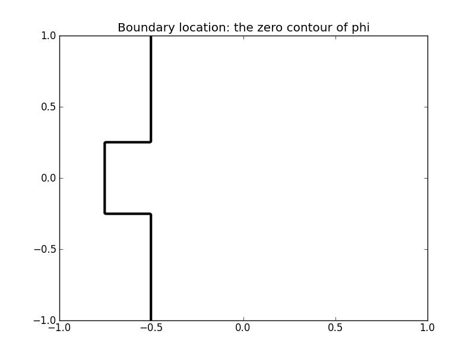
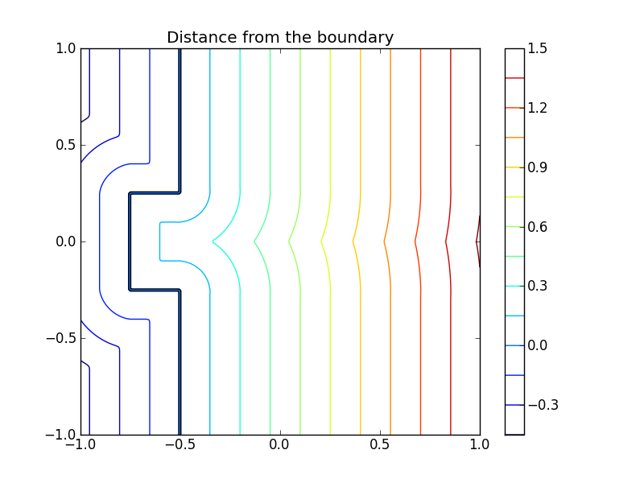
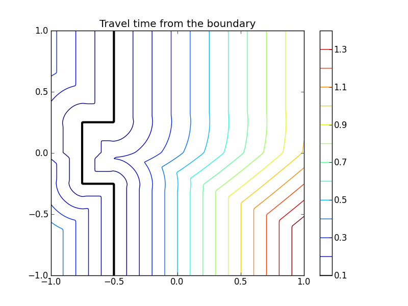
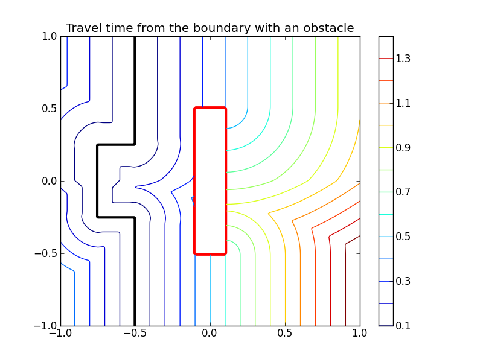

.. scikit-fmm documentation master file, created by
   sphinx-quickstart on Wed Feb  8 06:45:28 2012.
   You can adapt this file completely to your liking, but it should at least
   contain the root `toctree` directive.

scikit-fmm documentation
========================

:py:mod:`scikit-fmm` is an extension module which implements the fast
marching method.

The fast marching method is used to model the evolution of boundaries
and interfaces in a variety of application areas.

More specifically, the fast marching method is a numerical technique for
finding approximate solutions to boundary value problems of the
Eikonal equation,

.. math::
   F(x) | \nabla T(x) | = 1

Typically, such a problem describes the evolution of a closed curve as
a function of time :math:`T` with speed :math:`F(x)>0` in the normal
direction at a point x on the curve. The speed function is specified,
and the time at which the contour crosses a point x is obtained by
solving the equation. The initial location of the boundary is defined
by the zero contour (or zero level-set) of a scalar function.

In this document the scalar function containing the initial interface
location is referred to as phi. The scalar function phi can be thought to
exist in a dimension higher than the boundary of interest and only the
zero contour of the function is physically meaningful. The boundary
grows outward in the local normal direction at a speed given by
:math:`F(x)`.

:py:mod:`scikit-fmm` is a simple module which provides two functions:
:py:func:`skfmm.distance` and :py:func:`skfmm.travel_time`. The import
name of :py:mod:`scikit-fmm` is :py:mod:`skfmm`.

Examples
========
First, a simple example::

    >>> import skfmm
    >>> import numpy as np
    >>> phi = np.ones((3, 3))
    >>> phi[1, 1] = -1
    >>> skfmm.distance(phi)
    array([[ 1.20710678,  0.5       ,  1.20710678],
           [ 0.5       , -0.35355339,  0.5       ],
           [ 1.20710678,  0.5       ,  1.20710678]])

Here the zero contour of phi is around the (1, 1) point. The return
value of :py:func:`skfmm.distance` gives the signed distance from zero
contour. No grid spacing is given, so it is taken as 1. To specify a
spacing use the optional dx argument::

    >>> skfmm.distance(phi, dx=0.25)
    array([[ 0.3017767 ,  0.125     ,  0.3017767 ],
           [ 0.125     , -0.08838835,  0.125     ],
           [ 0.3017767 ,  0.125     ,  0.3017767 ]])

A more detailed example:

The boundary is specified as the zero contour of a scalar function phi:
::

 >>> import numpy as np
 >>> import pylab as pl
 >>> X, Y = np.meshgrid(np.linspace(-1,1,200), np.linspace(-1,1,200))
 >>> phi = -1 * np.ones_like(X)
 >>> phi[X > -0.5] = 1
 >>> phi[np.logical_and(np.abs(Y) < 0.25, X > -0.75)] = 1

::

 >>> d = skfmm.distance(phi, dx=1e-2)

:py:mod:`scikit-fmm` can also calculate travel times from an interface
given an array containing the interface propogation speed at each
point. Using the same initial interface position as above we set the
interface propagation speed to be 1.5 times greater in the upper half
of the domain.

::

 >>> speed = np.ones_like(X)
 >>> speed[Y > 0] = 1.5
 >>> t = skfmm.travel_time(phi, speed, dx=1e-2)

both :py:func:`skfmm.travel_time` and :py:func:`skfmm.distance`
support masked arrays for input. This allows an obstacle to be introduced.

::

 >>> mask = np.logical_and(abs(X) < 0.1, abs(Y) < 0.5)
 >>> phi  = np.ma.MaskedArray(phi, mask)
 >>> t    = skfmm.travel_time(phi, speed, dx=1e-2)

The full example is in examples/2d_example.py.
:doc:`examples`

Limitations:
============
:py:mod:`scikit-fmm` only works for regular Cartesian grids, but grid cells may
have a different (uniform) length in each dimension.

:py:mod:`scikit-fmm` does not compute level set extension or solve the
time-dependent level set equation.

Function Reference
==================

.. autofunction:: skfmm.distance

.. autofunction:: skfmm.travel_time

.. toctree::
   :maxdepth: 2

   examples

